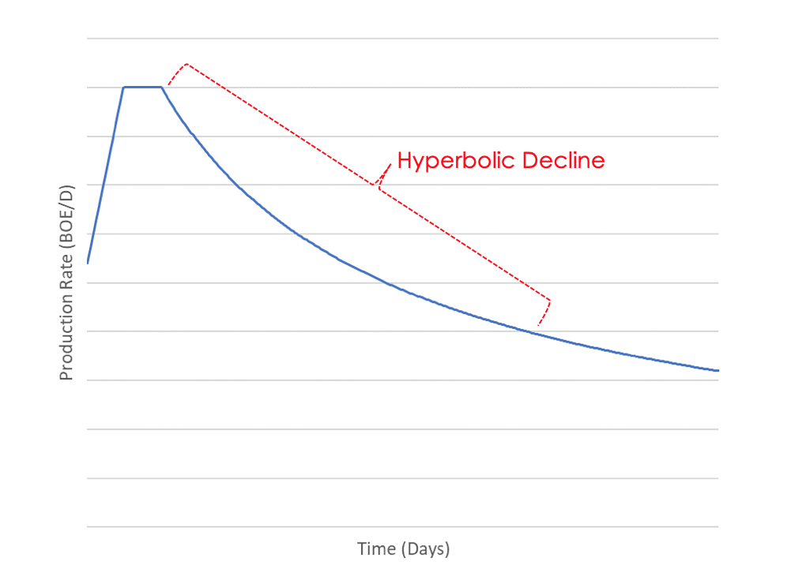

# Decline Curve Analysis Using RNN
> Using a Deep Recurrent Neural Network
> for Achieving Expert-Level Decline Curve Analysis

Decline Curve Analysis is a process of fitting an analytical curve (exponential, harmonic or hyperbolic) to production history data. This analysis is important for characterizing the performance of each well as well as forecasting the production in future.

For this tool, a hyperbolic model (most general DCA model) is used. 

Using robust curve fitting and optimization tools in Python, the code finds the best DCA parameters. The estimated parameters are

1) qi: Initial Production Rate
2) di: Initial Decline Rate
3) b: Hyperbolic Exponent

Automating this process is not an easy task. Experts (mostly petroleum engineers) usually decide where the curve fitting must start and where it must ends. Also, they are looking as different aspects of their production data and ignore some abnormalities that simple curve-fitting tools are not able to find and remove them. Therefore an intelligent system is needed to learn DCA from experts in a few examples and do the rest. Here, I am presenting a tool that uses deep learning (specifically Recurrent Neural Networks) to learn DCA analysis from an expert and apply it to the reset of the wells.

## Running the Code

Please run this code using a Python complier like Spyder. This tool use TKinter library for the frontend.
